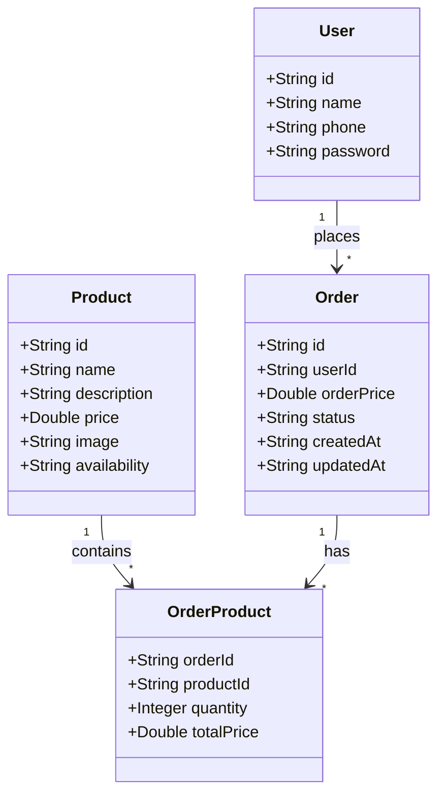

# Menu Api 
A menu api é uma aplicação desenvolvida para gerenciar pedidos de um cardápio online que criei anteriormente o front-end em React, permitindo que clientes façam pedidos de produtos para serem entregues em seus endereços e pagos na entrega. 
A API foi desenvolvida utilizando Java 17, Spring Boot, Spring Data JPA e PostgreSQL.

## Funcionalidades
**Gerenciamento de Produtos:** Adicionar, atualizar, listar e remover produtos do cardápio.
    
**Gerenciamento de Pedidos:** Realizar, listar e atualizar o status dos pedidos.

**Autenticação: (Em breve)** Usuários poderão se autenticar para realizar pedidos e visualizar o histórico de pedidos.

**Gerenciamento de Endereços:** Adicionar e atualizar endereços de entrega dos clientes.

## Tecnologias Utilizadas
* Java 17
* Spring Boot
* Spring Data JPA
* PostgreSQL
* Swagger
* Railway (hospedagem)

## Diagrama de classes



## Configuração do Ambiente
### Requisitos
* Java 17
* PostgreSQL

### Configuração do Banco de Dados
1. Basta executar como profile-dev para usar o banco local h2.
2. Caso prefira, crie um banco de dados no PostgreSQL.
3. Configure as variáveis de ambiente do arquivo `application-prd.yml` com as informações do seu banco de dados.

```
spring:
  datasource:
    url: jdbc:postgresql://${PGHOST}:${PGPORT}/${PGDATABASE}
    username: ${PGUSER}
    password: ${PGPASSWORD}
  jpa:
    hibernate:
      ddl-auto: update
    open-in-view: false
```

### Execução

1. Clone o repositório:
```
git clone https://github.com/biancasanches-dev/menu-app-server.git
cd menu-app-server
```

2. Compile e Execute a Aplicação:
Para compilar e executar a aplicação, utilize os seguintes comandos:
```
./gradlew build
./gradlew bootRun
```

## Documentação
A documentação da API foi feita utilizando o Swagger. Para acessar a documentação, acesse https://menu-app-server-production.up.railway.app/swagger-ui/index.html ou no seu local `http://localhost:8080/swagger-ui.html`.

## Contribuição
Contribuições são bem-vindas! Sinta-se à vontade para abrir uma issue ou enviar um pull request.

## Licença
Este projeto está licenciado sob a licença MIT. Veja o arquivo LICENSE para mais detalhes.

